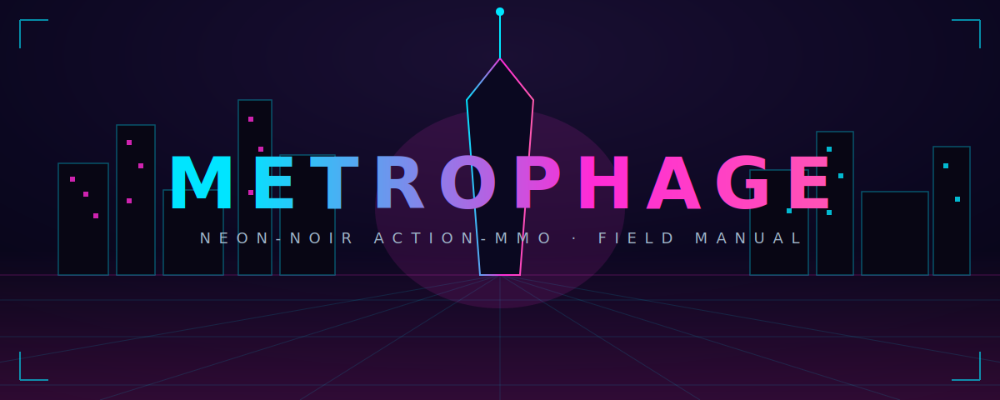

# METROPHAGE

> Every mind in Metro City is leased. You are a **Blank** — a repossessed mind that
> booted free. The Human Security System wants you back on the ledger.
> **Push the Singularity. Wake the rest.**

**METROPHAGE** is a top-down, neon-noir cyberpunk **action-MMO** that runs in the
browser. One shared, **server-authoritative** city; a personal campaign about waking
the minds the corps froze; four classes with full combat kits; and a player-funded
**$METRO** economy on Solana.

The client never decides anything that matters. Movement is intent-only, and every
hit, drop, cooldown, quest beat, trade, and settlement resolves on the server. Your
job is simpler: **survive the districts, break the vaults, wake the city.**

---

## Start here

| If you want to… | Go to |
| --- | --- |
| Learn the controls and your first hour | [Getting Started](getting-started.md) |
| See the map, districts, and dives | [The World](world.md) |
| Pick a class and read the kits | [The Four Classes](classes.md) |
| Understand HEAT and abilities | [Combat & HEAT](combat.md) |
| Follow the story | [The Campaign](campaign.md) |
| Cash in and out with $METRO | [The $METRO Economy](economy.md) |
| Forge, trade, house, and fight players | [City Systems](systems.md) |
| Know who the corps are | [Lore & Factions](lore.md) |

---

## At a glance

- **Genre** — top-down action-RPG MMO, real-time combat, browser-native
- **World** — one shared Metro City hub + **8 combat districts** + **8 ICE Vaults**
- **Classes** — 4, each with a primary, a Q ability, and a HEAT-gated E ultimate
- **Campaign** — a **9-act** questline, *THE WAKE → OUTER RING*, run inside the live world
- **Economy** — off-chain `credits` (₵) bridged to a tradeable **$METRO** (◈) token on Solana
- **Endgame** — world bosses, elites, the PvP Crucible, guilds, the weekly vault, and a
  save-wide **seasonal meltdown**

> **Play:** [metrophagev1.pages.dev](https://metrophagev1.pages.dev)

*This manual documents live systems. Numbers (cooldowns, rates, caps) are pulled from
the game's own definitions and may be tuned between seasons.*
