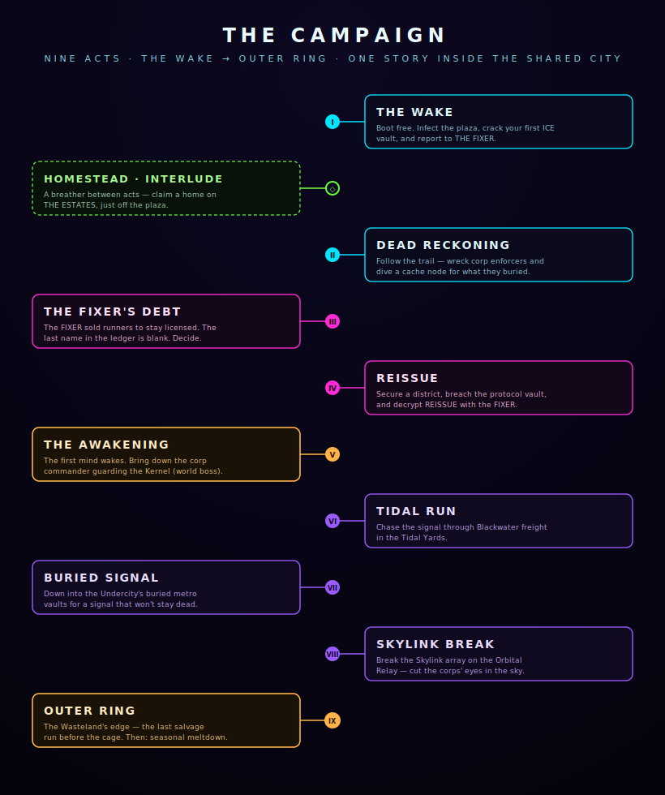

# The Campaign

One story, told in **nine acts**, runs inside the shared city. Progress is per-player —
your journal, your waypoints, your choices — but the world around you is live. The arc
runs from **THE WAKE** to **OUTER RING**, plaza to cage.

THE FIXER in Metro City opens and threads the whole thing. The early acts teach the
game's verbs — infect, dive, return — and the middle acts turn on a single, personal
question about the FIXER. Press **J** at any time for the journal and your current
waypoint.

## Act by act

**Act I — THE WAKE**
You boot free in Palantir Plaza. Infect the plaza's nodes, crack your first ICE Vault,
and report back to THE FIXER. The tutorial disguised as a jailbreak.

**Interlude — HOMESTEAD**
A breather between the opening acts: the FIXER points you to **THE ESTATES**, off the
plaza, and you claim a home of your own.

**Act II — DEAD RECKONING**
Follow the trail. Wreck a squad of corp enforcers and dive a cache node for what they
buried.

**Act III — THE FIXER'S DEBT**
The pivot. The FIXER sold runners like you to stay licensed — the ledger is pages of
names, and the last entry is blank, unsigned, waiting. It's you. You decide who they are
to you now.

**Act IV — REISSUE**
Secure a district, breach the protocol vault, and decrypt **REISSUE** with the FIXER —
the conspiracy under the whole system.

**Act V — THE AWAKENING**
The first mind wakes, and the Kernel knows it. Dive the Kernel vault and bring down the
**corp commander** it sends to prove the cage still works — a world boss that has killed
every prior version of you at this exact step.

**Act VI — TIDAL RUN**
Chase the signal through Blackwater freight in the Tidal Yards.

**Act VII — BURIED SIGNAL**
Down into the Undercity's buried metro vaults, after a signal that won't stay dead.

**Act VIII — SKYLINK BREAK**
Break the Skylink array on the Orbital Relay and cut the corps' eyes in the sky.

**Act IX — OUTER RING**
The Wasteland's edge — the last salvage run before the cage. And then the city tips
toward its **seasonal meltdown**.

## Side threads

Between the mainline acts, THE FIXER and the city hand you side quests — **STREET DEBTS**,
**NODE WAR**, and **GHOST SHEET** — that flesh out the districts and pay in gear and
credits without gating the main story.

---

*The campaign is deliberately re-run across seasons — "every prior me" is not a metaphor.
See* [Lore & Factions](lore.md) *for what REISSUE and the Blanks actually are.*
