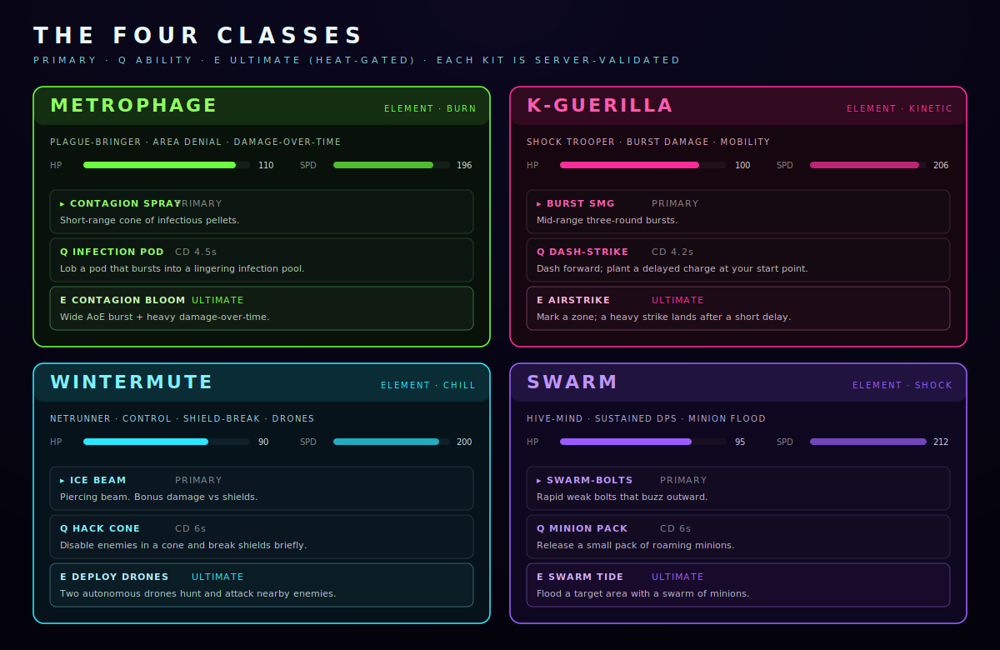

# The Four Classes

Four classes, four factions, four playstyles. Each has a **primary** weapon, a **Q**
ability, and a **HEAT-gated E** ultimate. Every kit is server-validated — the numbers
below are the real ones.

Your class also sets your **faction** in the district war and your signature color on
the map.

| Class | Element | HP | Speed | Fantasy |
| --- | --- | --- | --- | --- |
| **METROPHAGE** | Burn | 110 | 196 | Plague-bringer · area denial · DoT |
| **K-GUERILLA** | Kinetic | 100 | 206 | Shock trooper · burst · mobility |
| **WINTERMUTE** | Chill | 90 | 200 | Netrunner · control · shield-break |
| **SWARM** | Shock | 95 | 212 | Hive-mind · sustained DPS · minions |

---

## METROPHAGE — the plague

The tankiest class, built to own ground. You spray infection, seed pools, and let
damage-over-time do the closing.

- **Primary — CONTAGION SPRAY:** short-range cone of infectious pellets.
- **Q — INFECTION POD** *(CD 4.5s):* lob a pod that bursts into a lingering infection pool.
- **E — CONTAGION BLOOM** *(ultimate):* wide AoE burst plus heavy damage-over-time.

*Play it:* anchor a node, pool the choke points, and win the war of attrition.

## K-GUERILLA — the striker

The mobility class. Burst SMG damage plus a dash that leaves a bomb behind — hit, reposition,
detonate.

- **Primary — BURST SMG:** mid-range three-round bursts.
- **Q — DASH-STRIKE** *(CD 4.2s):* dash forward and plant a delayed charge at your start point.
- **E — AIRSTRIKE** *(ultimate):* mark a zone; a heavy strike lands after a short delay.

*Play it:* trade in and out, bait enemies onto your charge, and call the strike on a crowd.

## WINTERMUTE — the netrunner

The control class. Lowest HP, highest utility: a piercing beam that shreds shields, a
disable cone, and drones that fight for you.

- **Primary — ICE BEAM:** piercing beam. Bonus damage vs shields.
- **Q — HACK CONE** *(CD 6s):* disable enemies in a cone and break shields briefly.
- **E — DEPLOY DRONES** *(ultimate):* two autonomous drones hunt and attack nearby enemies.

*Play it:* peel shields, lock down the dangerous target, and let the drones peel damage off you.

## SWARM — the hive

The DPS-over-time class. Fast, weak bolts plus a rising tide of minions. You're never
alone and you never stop shooting.

- **Primary — SWARM-BOLTS:** rapid weak bolts that buzz outward.
- **Q — MINION PACK** *(CD 6s):* release a small pack of roaming minions.
- **E — SWARM TIDE** *(ultimate):* flood a target area with a swarm of minions.

*Play it:* keep the pressure constant, stack minions, and drown bosses in bodies.

---

## Picking a class

- **New to the genre / want to survive?** → **METROPHAGE** (most HP, forgiving zoning).
- **Want to feel fast and flashy?** → **K-GUERILLA** (dash-strike combos).
- **Like outplaying with utility?** → **WINTERMUTE** (control + drones, lowest HP).
- **Want constant action and pets?** → **SWARM** (fastest, minion-heavy).

Ability numbers (cooldowns, HP, speed) can be tuned between seasons — the mechanics
above stay true. How HEAT charges your **E** is covered next in
[Combat & HEAT](combat.md).
