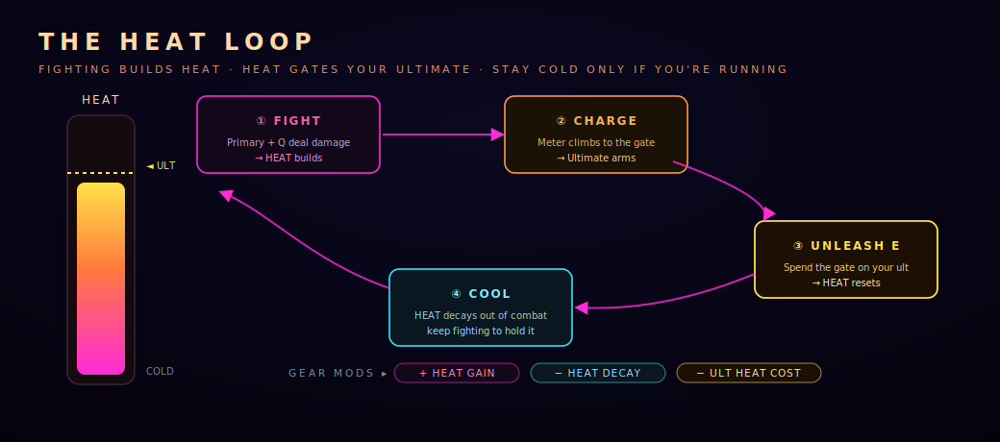

# Combat & HEAT

METROPHAGE is real-time, server-authoritative action combat. You always have your
primary and your dash; abilities and your ultimate layer on top. The system that ties it
together is **HEAT**.

## The moment-to-moment kit

| Slot | Input | Notes |
| --- | --- | --- |
| **Primary** | Mouse | Always available; each class fires differently (cone, burst, beam, rapid) |
| **Dash** | SPACE | Short burst with **i-frames** — the one sanctioned "get out of jail" |
| **Q — Ability** | Q | On a cooldown (4.2s–6s depending on class) |
| **E — Ultimate** | E | **Gated by HEAT**, not a flat cooldown |

## The HEAT loop

HEAT is the resource that powers your ultimate. It isn't a timer — it's earned.

1. **FIGHT.** Your primary and Q deal damage, and **HEAT builds.**
2. **CHARGE.** The meter climbs toward the gate; when it's full, your **E arms.**
3. **UNLEASH.** Cast your ultimate — it spends the gate and **HEAT resets.**
4. **COOL.** Out of combat, **HEAT decays.** You only stay cold if you're running.

> The design tension: your ultimate rewards staying *in* the fight. Play aggressively and
> your E comes online often; disengage and you cool off. **"Stay cold only if you're
> running."**

## Bending the loop with gear

Modifiers on implants and chips reshape how fast your ultimate comes online:

| Mod | Effect |
| --- | --- |
| **+ HEAT GAIN** | Build HEAT faster from every hit |
| **− HEAT DECAY** | Lose HEAT more slowly out of combat |
| **− ULT HEAT COST** | Your ultimate costs less HEAT to fire *(top-rarity chips only)* |

Stack these and you can turn a once-a-fight ultimate into a recurring threat. → see the
Forge in [City Systems](systems.md).

## Status effects

Each class's element applies an on-hit status:

| Element | Class | Effect |
| --- | --- | --- |
| **Burn** | METROPHAGE | Damage-over-time |
| **Chill** | WINTERMUTE | Slow |
| **Shock** | SWARM | Brief stun |
| **Kinetic** | K-GUERILLA | Raw burst (no status) |

## Dying

Death in METROPHAGE is a moment, not a menu — the **SIGNAL LOST** sequence. You lose
your footing in the fight, not your character. Get back up, get back in, and keep the
HEAT.

## Venting HEAT on purpose

Sometimes you *want* to be cold — before a long dive, or to reset. City services (like
the vendor's **Vent**) can clear HEAT for a small fee, and some actions dump it for you.
Most of the time, though, HEAT is a resource to hoard, not spend.
