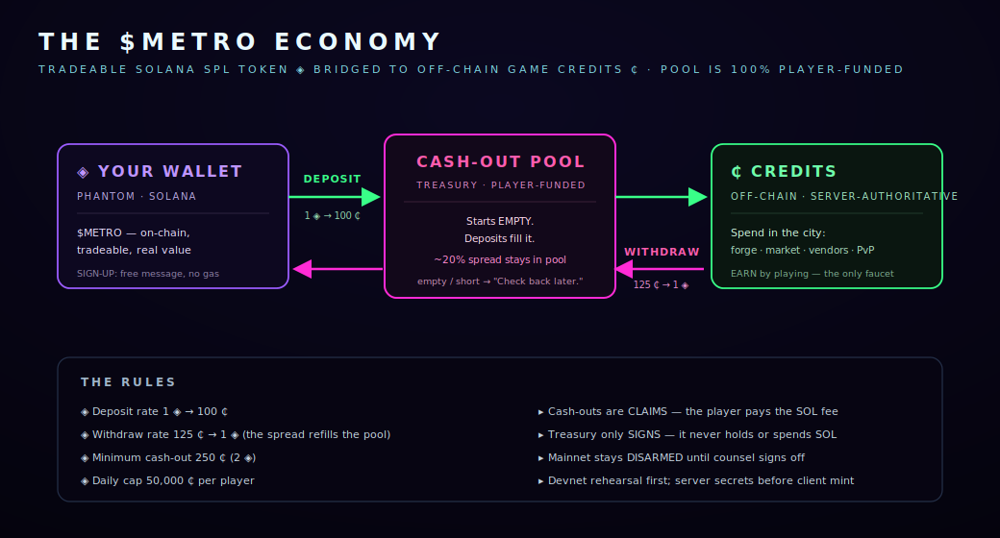

# The $METRO Economy

METROPHAGE has two currencies: off-chain **credits (₵)** that you earn and spend in the game, and a tradeable **$METRO (◈)** token on Solana. The bridge between them is player-funded and deliberately honest about when it's open.

## Two currencies

* **Credits (₵)** — off-chain, **server-authoritative** in-game currency. You earn them by playing and spend them at the forge, market, vendors, and Crucible. **Playing is the only faucet.**
* **$METRO (◈)** — an on-chain **Solana SPL** token with real, tradeable value. Sign-up is a free Phantom message (no gas). _(Robinhood Chain ERC-20 remains as a legacy path.)_

## The bridge, in one picture

You move value across the bridge in two directions, and a **player-funded pool** sits in the middle:

* **Deposit** — send $METRO, receive credits: **1 ◈ → 100 ₵**.
* **Withdraw (claim)** — cash credits out to $METRO: **125 ₵ → 1 ◈**.

The **\~20% spread** between deposit and withdraw stays in the pool. The pool **starts empty and is 100% player-funded** — it only holds what players have deposited. When it's empty or short, the game says exactly that: **"Check back later."** It is not a faucet, and it never pretends to be.

## The rules

| Rule             | Value                   |
| ---------------- | ----------------------- |
| Deposit rate     | **1 ◈ → 100 ₵**         |
| Withdraw rate    | **125 ₵ → 1 ◈**         |
| Minimum cash-out | **250 ₵** (2 ◈)         |
| Daily cap        | **50,000 ₵ per player** |
| Settlement       | Solana SPL (primary)    |

## How claims stay safe

Cash-outs are **claims**, and the security model is strict:

* **The player pays the SOL fee.** You are the fee payer on your own withdrawal.
* **The treasury only signs — it never holds or spends SOL.** It can't be drained of gas because it never has any to spend.
* **Mainnet stays disarmed** until counsel signs off; devnet rehearsal comes first, and server secrets are configured before the client mint so nobody can fabricate credits against an un-armed bridge.

> **In plain terms:** the on-chain layer is dormant until it's deliberately switched on, the pool only ever contains real player deposits, and no single wallet is trusted to hold the keys to the vault. Until then, the entire ₵ economy — earning, forging, trading, PvP — is fully live and playable off-chain.

## When the bridge is off

If you see **"$METRO · off-chain"** on login, that's expected: the token layer isn't armed yet. Nothing is broken — you can still earn credits, gear up, run contracts, and fight. The bridge simply arms later, when the mint goes live.
