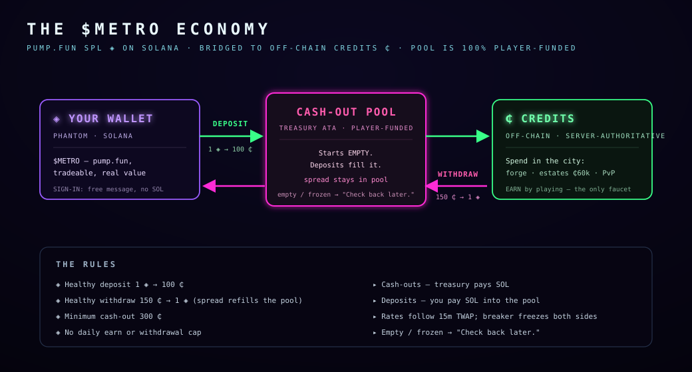

# The $METRO Economy

METROPHAGE has two currencies: off-chain **credits (₵)** that you earn and spend in the game, and tradeable **$METRO (◈)** on **Solana**. The bridge between them is player-funded and deliberately honest about when it's open.

## Two currencies

* **Credits (₵)** — off-chain, **server-authoritative** in-game currency. You earn them by playing and spend them at the forge, market, vendors, Crucible, and **THE ESTATES** (a Genesis Key lists at **₵60,000**). **Playing is the only faucet.**
* **$METRO (◈)** — an on-chain token on **Solana**, launched on **pump.fun** (bonding curve, then **PumpSwap**). Real, tradeable value. Connect **Phantom, Solflare, or Backpack**; sign-in is a free message (no SOL). See [Solana](solana.md) for wallets, gas, and deeds.

## The bridge, in one picture

You move value across the bridge in two directions, and a **player-funded pool** sits in the middle:

* **Deposit** — send $METRO, receive credits. Healthy reference: **1 ◈ → 100 ₵**.
* **Withdraw (claim)** — cash credits out to $METRO. Healthy reference: **150 ₵ → 1 ◈**.

The spread between deposit and withdraw stays in the pool. **100 / 150 is the healthy reference**, not a promise every hour of every day — live rates follow a **Solana oracle** (15-minute TWAP), and the spread can widen when the city is crowded or the token is thrashing.

The pool **starts empty and is 100% player-funded** — it only holds what the treasury actually bought plus what players have deposited. When it's empty, short, or the oracle trips the **circuit breaker**, the game says exactly that: **"Check back later."** It is not a faucet, and it never pretends to be.

## The rules

| Rule             | Value                                      |
| ---------------- | ------------------------------------------ |
| Healthy deposit  | **1 ◈ → 100 ₵**                            |
| Healthy withdraw | **150 ₵ → 1 ◈**                            |
| Live rates       | Oracle **TWAP** × the healthy spread       |
| Minimum cash-out | **300 ₵**                                  |
| Caps             | **None** — no daily earn or withdraw cap   |
| Sinks            | Estates **₵60k**, furniture, forge, PvP    |
| Settlement       | [Solana](solana.md) · pump.fun / PumpSwap  |

## How claims stay safe

Cash-outs are **claims**, and the security model is strict:

* **Deposits cost a little SOL**, paid through your wallet — your $METRO goes straight into the player-funded pool. Credits land after the transfer is **finalized**.
* **Cash-outs are treasury-paid on Solana.** The treasury pays SOL for the transfer (and opens your $METRO token account if you don't have one). If treasury SOL is empty, the pool is empty, or the oracle is frozen, cash-outs stay closed: **"Check back later."**
* **The server checks your credits and the pool before it pays.** A claim cannot create value that is not there. There is no daily earn or withdrawal cap.
* **Mainnet stays disarmed** until counsel signs off. The mint address in the Metro panel is the live **pump.fun** contract — copy it as-is; Solana addresses are case-sensitive.

> **In plain terms:** the on-chain layer is dormant until it's deliberately switched on, the pool only ever contains real $METRO, and the city will freeze the bridge rather than invent a price. Until then, the entire ₵ economy — earning, forging, trading, PvP — is fully live and playable off-chain.

## When the bridge is off

If you see **"$METRO · off-chain"** on login, that's expected: the token layer isn't armed yet. Nothing is broken — you can still earn credits, gear up, run contracts, and fight. The bridge simply arms later, when the mint goes live.

If the panel shows the bridge **frozen**, the oracle tripped (stale quote or a violent jump). Both deposit grants and cash-outs return **"Check back later."** until the price has been stable again. Play the city. Don't sit on the panel.
