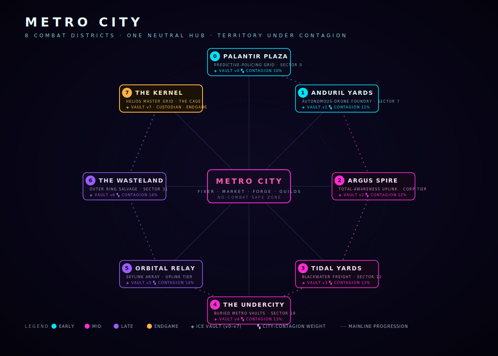

# The World

Metro City is one shared, server-simulated map: a neutral social hub ringed by eight combat districts, each with its own instanced dive. The city runs live — territory shifts, events fire, and bosses walk whether you're watching or not.

## Metro City — the hub

The center of the map is a **no-combat safe zone** where the whole city passes through. Everything social or economic happens here:

* **THE FIXER** — opens the campaign and hands out daily contracts
* **The Market** — cross-zone player exchange (credits and premium $METRO listings)
* **The Forge** — craft, reroll, and upgrade gear
* **Guilds, the Tailor, the World Map, and Leaderboards**
* **THE ESTATES** — the housing street, just off the plaza

## The eight combat districts

Eight districts wrap the hub, each a distinct corp holding with its own sector, biome, and **city-contagion weight** (how much of the meta "Singularity" meter it's worth when held). They escalate roughly in order, from **Palantir Plaza** to **THE KERNEL**.

Your **class is your faction** in the district war — METROPHAGE, K-GUERILLA, WINTERMUTE, and SWARM fight over the same infection nodes. → [The Eight Districts](districts.md)

## ICE Vaults & dives

Every district hides an **ICE Vault** (zones **v0–v7**) — an instanced, depth-scaled dive into a frozen-mind storage vault. Entry hall → split guard chambers → antechamber → the core, where you channel a **memory fragment** free. → [ICE Vaults & Dives](vaults.md)

There's also **THE UNDERLINE**, the subway dungeon threading beneath the city.

## Dynamic world events

The server runs live events per district: a telegraph, then **real simulation effects**, then a payout to everyone still standing.

| Event                  | What happens                                                   |
| ---------------------- | -------------------------------------------------------------- |
| **NEON STORM**         | Charged weather sweeps the district — move or get caught in it |
| **BLACKOUT**           | The grid drops; visibility and rules shift until power returns |
| **REPO PURGE WAVE**    | The HSS sends a repossession wave — survive the surge          |
| **CONTAGION OUTBREAK** | Infection spikes across nodes; contain it for the reward       |

Events aren't cosmetic. They change the sim, and clearing one pays **everyone alive** in the district when it resolves.

## Territory & contagion

Districts are held by controlling their **infection nodes**. Nodes are linked, and contagion spreads along those links, so holding a district is about map control, not a single point. Each district's contagion weight feeds the city-wide meter — and when the meter tips, the season moves toward its **meltdown**.

## Seasonal meltdown

METROPHAGE is built to end and restart. When the save-wide Singularity tips over, the city enters a **new era** — a seasonal reset that re-opens the whole ladder. What you carry, what resets, and what a new era looks like is the long game.
